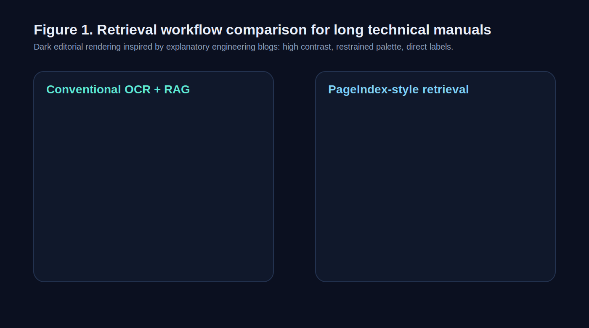
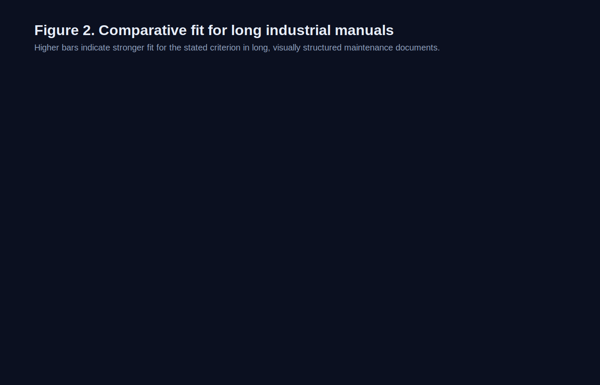

# Human-Centric Document Retrieval: Evaluating PageIndex for Long Technical Manuals

**Carley Fant**  
Technical and Scientific Writing, Section V01  
Spring Semester 2026  
Columbus State University  
April 6, 2026

\newpage

# Table of Contents

1. Abstract
2. Introduction
3. Literature Review
4. Discussion
5. Conclusion
6. Reference Page

\newpage

# Abstract

Organizations in engineering, maintenance, manufacturing, and compliance rely on long technical documents that mix paragraphs, tables, diagrams, warnings, and cross-references. Those documents are difficult for artificial intelligence systems to search accurately because many retrieval pipelines flatten pages into plain text before answering questions. Retrieval-augmented generation (RAG) improved document question answering by retrieving relevant passages before generation, but standard RAG systems still depend on chunking, embeddings, and similarity search. In long manuals, that design can split related steps, detach warnings from procedures, or ignore page layout that helps a human reader make sense of the document. This report examines whether a more human-centered approach, represented here by the PageIndex framework, is a better fit for long-document retrieval. PageIndex indexes documents as structured pages rather than only as text chunks and uses reasoning over that structure instead of vector search alone. This report reviews the development of keyword retrieval, dense retrieval, and layout-aware document intelligence, then compares PageIndex with conventional RAG for one concrete use case: industrial maintenance manuals. The argument is narrower than “PageIndex replaces RAG.” Instead, PageIndex appears most useful when document structure carries part of the meaning.

# Introduction

Large language models have made it easier to ask natural-language questions about large document collections. In practice, however, many professional documents do not behave like simple blocks of text. A maintenance manual, for example, may spread one procedure across multiple pages and place a warning, figure, or exception note in a separate column or appendix. If that material is flattened into plain text and broken into chunks, the system may retrieve only part of the answer.

This problem matters in real workplaces. A technician using a 500-page equipment manual does not only need a sentence that sounds relevant. The technician may need the correct step order, a nearby warning label, a torque table, and a diagram that appears on the next page. A retrieval error in that setting is not just inconvenient. It can produce an incomplete or misleading answer.

Retrieval-augmented generation, usually shortened to **RAG**, was developed to reduce hallucinations by retrieving external documents before a language model generates a response (Lewis et al., 2020). Standard RAG systems typically split documents into small segments, convert those segments into numerical representations called **embeddings**, and retrieve the segments whose embeddings are most similar to the query. This approach works well for many text-heavy tasks, but it also introduces a new set of problems: chunk boundaries can break context, embeddings may blur local detail, and page layout is often treated as secondary information rather than part of the meaning of the document itself.

This report investigates a more human-centric alternative: the **PageIndex** framework. According to the official developer documentation, PageIndex is a vectorless, reasoning-based retrieval framework that builds a tree-structured index of a document and lets a model navigate that structure in a traceable way (PageIndex Developer Docs, 2026). The key idea is simple. Instead of asking a system to match a question to isolated text chunks, PageIndex asks it to move through a document more like a human reader who uses headings, sections, and page-level context to find the answer.

The central question of this report is whether that approach is meaningfully better for long technical manuals. To answer that question, the report first reviews earlier retrieval approaches, then examines limitations in conventional RAG, and finally evaluates where PageIndex offers real advantages and where its evidence base is still emerging.

# Literature Review

## From Keyword Search to Dense Retrieval

Early document retrieval systems relied on keyword matching and inverted indexes. Manning, Raghavan, and Schutze (2008) explain that these systems are efficient when users know the right terms, but they are less effective when the wording of the query differs from the wording of the source. That weakness is important for technical writing because users often ask questions in everyday language even when the document itself uses specialized vocabulary.

Dense retrieval emerged as a response to that limitation. Instead of matching exact terms, dense retrieval represents queries and documents as embeddings in a shared vector space. Karpukhin et al. (2020) showed that dense passage retrieval could outperform strong BM25 baselines on open-domain question-answering benchmarks, improving top-20 passage retrieval accuracy by substantial margins. In plain terms, dense retrieval made it easier for systems to match by meaning rather than exact wording.

That shift laid the groundwork for modern RAG systems. Lewis et al. (2020) formalized retrieval-augmented generation as a method that combines a generative language model with non-parametric memory, meaning knowledge stored outside the model in retrieved documents. Their work is foundational because it frames retrieval not as a separate search utility, but as part of the answer-generation process itself. RAG improved factual grounding and helped models produce answers tied to evidence rather than relying only on internal parameters.

## Strengths and Limits of Conventional RAG

RAG remains attractive because it is practical. It allows organizations to update a knowledge base without retraining a model, and it gives users answers that can be tied back to retrieved sources. Borgeaud et al. (2022) further demonstrated the power of retrieval-augmented systems at scale by showing that retrieval could improve language-model performance while reducing the need for extremely large parameter counts.

Even so, retrieval quality remains the decisive factor. If the system retrieves the wrong passage, the final answer can still be wrong. Barnett et al. (2024) identify seven failure points in real RAG systems, including problems with chunking, ranking, query formulation, context assembly, and evaluation. Their findings are especially useful for this report because they move beyond ideal benchmark conditions and focus on operational systems. The paper shows that RAG pipelines often fail not because retrieval is useless, but because retrieval engineering is fragile.

One recurring weakness is **chunking**, the practice of splitting documents into smaller units so they can be embedded and retrieved efficiently. Chunking is necessary for many pipelines, but it can also disrupt context. In a maintenance manual, a chunk may contain an instruction without the caution note that appears immediately beside it in the original page layout. A model may then retrieve a technically relevant passage while missing the information that makes it safe or complete.

Another weakness is that standard RAG pipelines often treat layout as noise. Many systems begin with optical character recognition, or **OCR**, which converts a page image into machine-readable text. OCR is useful, but plain OCR output does not preserve every spatial relationship that matters in diagrams, forms, sidebars, or visually structured technical pages. When document meaning depends partly on where information appears, text-only retrieval can become lossy.

## Layout-Aware Document Understanding

Research in document intelligence has increasingly recognized that layout carries meaning. Xu et al. (2020), in their work on LayoutLM, argue that text-level modeling alone neglects spatial and visual information that is vital for document image understanding. Their results show that combining text with layout features improves performance on real-world document tasks such as form understanding and receipt understanding. The significance of that finding for this report is direct: if layout matters for forms and receipts, it is reasonable to expect that layout also matters for long technical manuals containing tables, callouts, diagrams, and section hierarchies.

This line of research supports a broader claim. Not every retrieval failure comes from bad wording or weak embeddings. Some failures start earlier, with the document representation itself. Once a manual has been reduced to extracted text alone, much of the original page logic is already gone.

## PageIndex and Human-Centric Retrieval

PageIndex is a recent framework built around that concern. The official documentation describes it as a vectorless, reasoning-based retrieval system that transforms documents into a tree-structured index and allows large language models to perform agentic reasoning over that structure (PageIndex Developer Docs, 2026). The public product site also reports high accuracy on FinanceBench and emphasizes page-level citations, hierarchical indexing, and the absence of vector databases or chunking (PageIndex, 2026).

The framework matters because it changes the retrieval question. In conventional RAG, the system is usually asking which chunk is closest to the query. In PageIndex, the system is deciding where to go next in the document structure. That difference is closer to how a person actually works through a manual by using the table of contents, section headings, appendices, and nearby figures.

The evidence for PageIndex still needs to be handled carefully. Official benchmarks and product documentation are useful for understanding the system's design, but they are not the same as broad, independent academic validation. In this report, then, PageIndex is treated as an emerging retrieval architecture supported by early evidence and by related layout-aware document research, not as a settled replacement for every existing method.

# Discussion

For a final research report, comparison matters more than novelty alone. The strongest way to evaluate PageIndex is to compare it with conventional RAG in a setting where layout and continuity matter. Industrial maintenance manuals provide that setting because they combine long procedures, page-level references, warnings, tables, and visual elements.

Table 1 compares four retrieval approaches relevant to this problem. As the table shows, the main difference is not simply whether a system is "AI" or "non-AI." The deeper issue is what form of document representation each system assumes.

**Table 1. Comparison of retrieval approaches for long technical documents**

| Approach | Core representation | Main strengths | Main weaknesses | Best use case |
| --- | --- | --- | --- | --- |
| Keyword or BM25 search | Indexed terms | Fast, transparent, easy to maintain | Requires exact or near-exact wording; weak on paraphrase | Known-item lookup |
| Dense-retrieval RAG | Text chunks plus embeddings | Better semantic matching; scalable question answering | Chunking can split context; layout often flattened | Text-heavy knowledge bases |
| Layout-aware document models | Text plus spatial or visual features | Better document understanding where layout matters | Often focused on extraction tasks rather than retrieval workflows | Forms, receipts, structured pages |
| PageIndex-style retrieval | Page hierarchy and reasoning over document structure | Preserves section context, page relationships, and traceability | Newer approach; less independent validation; may add orchestration complexity | Long, highly structured manuals and reports |

The practical advantage of PageIndex becomes clearer when the use case is narrowed further. Imagine a field technician searching a compressor maintenance manual for the startup procedure after a seal replacement. In a chunk-based system, one chunk may contain the sequence of steps, another may contain the pressure threshold, and a third may contain a warning box about overheating. If the system retrieves only the first chunk because it is the closest semantic match, the answer may sound complete while leaving out material that changes the correct action. A page-structured approach has a better chance of preserving those local relationships.

This does not make conventional RAG ineffective. Standard RAG remains a strong choice for many tasks, especially when documents are mostly linear prose and the target is a short factual passage. In those cases, dense retrieval offers a practical balance of speed, flexibility, and performance. Long technical manuals are different. They are visual documents, and some of their meaning sits in the layout itself.

Table 2 applies that comparison directly to industrial manuals. It uses five criteria that emerged from both the literature and the course feedback: retrieval completeness, layout preservation, traceability, update flexibility, and audience usability.

**Table 2. Evaluation criteria for industrial maintenance manuals**

| Criterion | Why it matters | Conventional RAG | PageIndex-style retrieval |
| --- | --- | --- | --- |
| Retrieval completeness | Procedures often depend on adjacent warnings, tables, or later steps | Moderate; depends heavily on chunking strategy | Stronger potential because page and section context stay intact |
| Layout preservation | Visual grouping can signal meaning and safety relevance | Usually weak unless layout features are added separately | Built around page structure and hierarchy |
| Traceability | Users need to verify where an answer came from | Good when citations are attached to chunks | Strong when navigation path and page references are explicit |
| Update flexibility | Manuals and procedures change over time | Strong; indexes can be refreshed without full retraining | Also strong, though implementation details vary by system |
| Usability for non-experts | Users need answers that reflect whole procedures, not fragments | Can be good, but incomplete retrieval can mislead | Potentially stronger for structured document navigation |

As Table 2 suggests, the main value of PageIndex is not that it rejects retrieval, but that it changes the unit of retrieval from arbitrary text slices to navigable document structure. That design choice directly addresses several failure modes identified by Barnett et al. (2024), especially those involving chunk boundaries, ranking errors, and noisy context assembly.

There is an interpretive advantage as well. Human readers are more likely to trust a system when they can see how it reached an answer. A page-based retrieval path is easier to explain than a hidden nearest-neighbor search over high-dimensional embeddings. In regulated or safety-sensitive environments, that matters.

The limitations are real. First, PageIndex-specific claims are currently supported heavily by official documentation and public product material. Second, vector search remains highly effective in many document settings and is supported by a much deeper research base. Third, a PageIndex-style system still requires careful orchestration, model selection, and evaluation to work reliably in production. A more human-like retrieval strategy does not remove the need for engineering discipline.

So the best near-term claim is not “PageIndex replaces RAG.” The stronger claim is narrower: PageIndex addresses a class of retrieval failures that become more serious as documents grow longer, more structured, and more visual. That makes it a meaningful development for professional environments where missing context is costly.

# Conclusion

The research literature shows a clear progression from keyword search to dense retrieval and then to retrieval-augmented generation. Each stage improved how systems locate and use information. However, the literature also shows that long-document retrieval remains difficult when documents are broken into isolated text chunks and stripped of their original structure.

For long technical manuals, that limitation is significant. These documents depend on page layout, section hierarchy, diagrams, warnings, and cross-references. In such settings, conventional RAG can retrieve relevant language while still missing essential context. PageIndex is promising because it approaches retrieval more like a human reader would: by navigating the document as a structured artifact instead of only as an embedding space.

The conclusion here is qualified, but it is still clear. PageIndex should not be treated as a universal replacement for RAG, and its public evidence base is still developing. Even so, it points toward a real improvement in document intelligence because it addresses a weakness in text-only retrieval workflows. For industrial maintenance manuals and similar long technical documents, a human-centric retrieval model may offer better completeness, better traceability, and a safer basis for question answering than chunk-based systems alone.

Future work should test these systems with independent evaluations on real-world document collections, not only on public benchmarks or vendor claims. If those evaluations confirm early results, PageIndex-style retrieval may become a valuable standard for document-heavy professional environments.

# Reference Page

Barnett, S., Kurniawan, S., Thudumu, S., Brannelly, Z., & Abdelrazek, M. (2024). *Seven failure points when engineering a retrieval augmented generation system*. Proceedings of the First International Conference on AI Engineering: Software Engineering for AI. https://arxiv.org/abs/2401.05856

Borgeaud, S., Mensch, A., Hoffmann, J., Cai, T., Rutherford, E., Millican, K., van den Driessche, G., Lespiau, J.-B., Damoc, B., Clark, A., de Las Casas, D., Guy, A., Menick, J., Ring, R., Hennigan, T., Huang, S., Maggiore, L., Jones, C., Cassirer, A., ... Sifre, L. (2022). *Improving language models by retrieving from trillions of tokens*. Proceedings of the 39th International Conference on Machine Learning, 2206-2240. https://proceedings.mlr.press/v162/borgeaud22a.html

Karpukhin, V., Oguz, B., Min, S., Lewis, P., Wu, L., Edunov, S., Chen, D., & Yih, W.-t. (2020). *Dense passage retrieval for open-domain question answering*. Proceedings of the 2020 Conference on Empirical Methods in Natural Language Processing, 6769-6781. https://aclanthology.org/2020.emnlp-main.550/

Lewis, P., Perez, E., Piktus, A., Petroni, F., Karpukhin, V., Goyal, N., Kuttler, H., Lewis, M., Yih, W.-t., Rocktaschel, T., Riedel, S., & Kiela, D. (2020). *Retrieval-augmented generation for knowledge-intensive NLP tasks*. Advances in Neural Information Processing Systems, 33. https://papers.nips.cc/paper/2020/hash/6b493230205f780e1bc26945df7481e5-Abstract.html

Manning, C. D., Raghavan, P., & Schutze, H. (2008). *Introduction to information retrieval*. Cambridge University Press. https://nlp.stanford.edu/IR-book/

PageIndex. (2026). *Vectorless, reasoning-based document intelligence*. https://www.pageindex.dev/

PageIndex Developer Docs. (2026). *What is PageIndex?* https://docs.pageindex.ai/

Xu, Y., Li, M., Cui, L., Huang, S., Wei, F., & Zhou, M. (2020). *LayoutLM: Pre-training of text and layout for document image understanding*. Proceedings of the 26th ACM SIGKDD Conference on Knowledge Discovery and Data Mining, 1192-1200. https://www.microsoft.com/en-us/research/publication/layoutlm-pre-training-of-text-and-layout-for-document-image-understanding/
